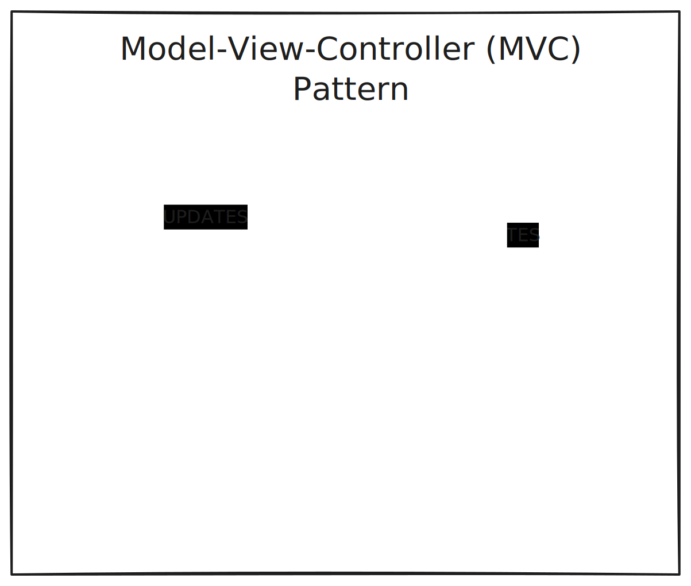
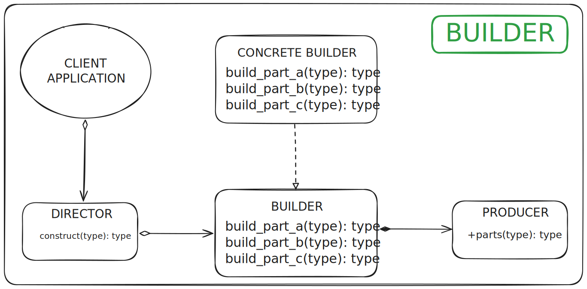

# Design Patterns
OO patterns that solve common problems. Some are more frequently used than others.
## Overview of the three subtypes of design patterns
### Creational Patterns
* Purpose
  * build objects systematically
* Benefit
  * flexibility
#### Pet Shop Scenario
##### Problem
As it scales and adds more and more types of animals, creating individual classes for each pet type scales poorly
##### Solution
Abstract or non-abstract class (Pet) containing common fields and functions.  Just add another subclass for a type of pet.
##### Additional Benefits
Adding new subtypes at runtime through a common interface.  
For example: there is a function in the PetShopClass that prints the pets name ```code displayPetName(Pet pet)```.  If we add a new type of pet, we don't need to change the PetShopClass, we just need to add and implment an interface for the new pet type (Bird) on Pet object.  The Pet Bird could then be treated as a Pet or a Bird.
### Structural Patterns
* Purpose
  * used to establish repeatable relationships
* Benefit
  * satisfy specific FR/NFRs with flexibility and efficiency
### Behavioural Patterns
* Purpose
  *  optimise object interactions
* Focus
  * protocols between objects
#### Banking System Scenario
##### Problem
Needs to offer FRs to withdraw and deposit money, and it would be useful to compose individual withdrawals and deposits into a transaction.  
Also, it would be useful to have a way to cancel the transactions. A detailed breakdown of the FRs are below:
* Withdraw
  * identify the user
  * authenticate the user
  * input the amount to withdraw from which account
  * validate the amount requested to withdraw and the funds in the account
  * allows or denies the transaction
Already there are several moving parts, authentication, balance checking, monitoring and rolling back the transaction.
##### Solution
THe OO concepts below apply to each type of design pattern.  In this case, we are using interfaces and signatures to define the protocols between objects.
* OO design concepts
  * Creational: polymorphism
  * Structural: inheritance
  * Behavioural: interfaces and signatures
## Level of abstraction:
### Design Patterns
The are low level and address how classes are instantiated, structured and orchestrated
* Low level
* concrete
* class-level
* local concerns
For example the builder pattern is a creational pattern that has a local effect but doesn't have a global impact.
### Architecture Patterns
These are at the module level and address global concerns = system design patterns (NFRs)
* high level
* abstract
* module-level
* global concerns
For example, the MVC pattern is an architectural pattern that improves modifiability and has a global impact. In this case modifiability is improved since changes in one layer (Model) are isolated from the other layers (View and Controller).  
##### For example:



## Creational Patterns
### Builder Pattern
#### Car manufacturing problem
Many different parts must be assembled in specific ways to create a car.
##### Problem
Constructing complex objects.
* anti-patterns 
  * the telescoping constructors, where there are too many constructors and too many parameters
  * a default constructor and then a set of methods to set the properties of the object
##### Solution
The **BUILDER** pattern is used to construct complex objects step by step.
* Partitions the complex object construction into 4 different roles
  * Director - responsible for building the product
  * Builder - interface whose functions build parts of the object
  * ConcreteBuilder - implements the Builder interface and implements the functions to build the parts of the object
  * Product - represents the parts being assembled into the final product
The focus of the **BUILDER** pattern does not rely on polymorphism but rather a divide and conquer approach.




